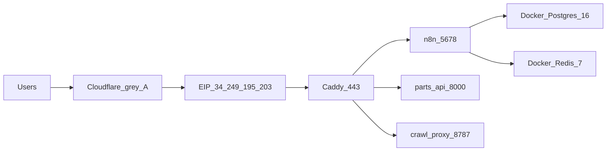

This is the **previous** public origin. DNS flipped to DigitalOcean on 4 September 2026. The n8n container on this box is **stopped**. Leave the instance up for a day as rollback, then stop it and release the Elastic IP.

AWS account `338428745150`, region **`eu-west-1`** (Ireland). Do not confuse this with OmniAI leftovers in `eu-central-1`.

## EC2

Verified on the box 3 September 2026.

| Field | Value |
| --- | --- |
| Name tag | `n8n` |
| Instance ID | `i-02b985625556f7bd6` |
| Type | `t3a.large` (2 vCPU / 8 GB) |
| AZ | `eu-west-1a` |
| Hostname | `ip-172-31-24-166` |
| Public / Elastic IP | `34.249.195.203` |
| SSH user | `ubuntu` |
| AWS key name on the box | `aws_n8n_ireland` (we do not hold that private key) |
| Agent SSH | `ssh -i ~/.ssh/omniai_do ubuntu@34.249.195.203` |
| Disk | 50 GB gp2 |
| List price seen on the bill | about **66 USD / month** |

## What ran on the box

One Docker host. Two compose projects.

| Container | Image (when live) | Workdir |
| --- | --- | --- |
| `n8n` | `n8nio/n8n` **2.14.2** | `/opt/n8n` |
| `postgres` | `postgres:16` | `/opt/n8n` |
| `redis` | `redis:7-alpine` | `/opt/n8n` |
| `caddy` | `caddy:latest` | `/opt/n8n` |
| `crawl-proxy` | `crawl-proxy` (local) | `/opt/n8n` |
| `parts-api` | **`ai-lens-parts-api`** (local) | `/opt/ai-lens` |

`/opt/n8n/docker-compose.yml` listed `parts-api` as `image: ai-lens`. The running container was `ai-lens-parts-api`.

## Caddy routes (unchanged on DigitalOcean)

| Path | Backend |
| --- | --- |
| `/api/v1/identify-part` | `parts-api:8000` |
| `/api/v1/search-parts` | `parts-api:8000` |
| `/api/v1/images/*` | `parts-api:8000` |
| `/health` | `parts-api:8000` |
| `/crawl-proxy/*` | `crawl-proxy:8787` (path stripped) |
| everything else | `n8n:5678` |

## What this page is not

OmniAI Chatwoot AWS leftovers live in **Frankfurt** (`eu-central-1`). That delete list is on [OmniAI AWS architecture](/kb/omniai/aws-architecture). Do not stop this Ireland instance as part of the OmniAI cleanup until the DigitalOcean host has had a healthy day.
