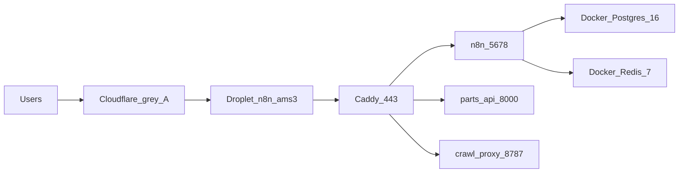

Verified 4 September 2026 after DNS flip. Live product traffic is **not** AWS Ireland.

Same DigitalOcean **OmniAI** project and AMS3 VPC as Chatwoot. Separate droplet. Separate Docker. No managed Postgres or Valkey.

## DigitalOcean project **OmniAI**

Region **AMS3**. Project ID `f66b1882-ccdd-440e-a68f-30f079059938`. VPC `omniai-prod-ams3` `4e32eb8f-2fe4-4f1f-9524-702f089f2473` (`10.50.0.0/20`).

n8n is a **third droplet** in this project. It does not use `omniai-prod-pg`, `omniai-prod-valkey`, or the Spaces bucket. Those stay Chatwoot-only.

| Console name | Kind | Size | Who uses it |
| --- | --- | --- |
| `n8n-ams3` | Droplet, tags `n8n` + `production`, `167.172.39.204` | 8 GB / 2 vCPU / 100 GB (`s-2vcpu-8gb-amd`) | n8n + parts-api + crawl-proxy |
| `omniai-prod-ams3` | Droplet | 8 GB / 4 vCPU / 160 GB | OmniAI live — do not install n8n here |
| `omniai-staging-ams3` | Droplet | 8 GB / 4 vCPU / 160 GB | OmniAI staging — do not install n8n here |

List price for this n8n droplet is **42 USD / month**. That replaces the Ireland `t3a.large` bill (about 66 USD). No managed database add-on.

## Droplet

| Field | Value |
| --- | --- |
| Name | `n8n-ams3` |
| Public IP | `167.172.39.204` |
| Private IP | `10.50.0.6` |
| Droplet ID | `597520995` |
| Size | 8 GB RAM, 2 vCPU, 100 GB disk (`s-2vcpu-8gb-amd`) |
| OS | Ubuntu 24.04 |
| Region | AMS3 |
| VPC | `4e32eb8f-2fe4-4f1f-9524-702f089f2473` |
| Project | OmniAI `f66b1882-ccdd-440e-a68f-30f079059938` |
| Firewall | `n8n-ams3` `3c48d7dc-b1e5-4801-a6c4-7aefdfa7761b` — TCP 22 / 80 / 443 |
| Swap | 2G at `/swapfile` |
| SSH | `ssh -i ~/.ssh/omniai_do root@167.172.39.204` |
| SSH key | DigitalOcean `omniai-cursor-agent` (ID `58992798`) |
| n8n image | **`n8nio/n8n:2.14.2`** |

Do not attach this droplet to the OmniAI Chatwoot firewall. It has its own.

## App on the box

| Field | Value |
| --- | --- |
| n8n dir | `/opt/n8n` |
| AI Lens dir | `/opt/ai-lens` |
| Compose | `/opt/n8n/docker-compose.yml` |
| Caddyfile | `/opt/n8n/Caddyfile` |
| n8n env | `/opt/n8n/.env` |
| parts-api env | `/opt/n8n/parts-api.env` |
| Data | Docker volumes `n8n_n8n_data`, `n8n_postgres_data`, `n8n_redis_data`, `n8n_caddy_data` |

Caddy routes: parts-api prefixes, `/health`, `/crawl-proxy/*`, everything else to n8n. See [AWS architecture](/kb/n8n/aws-architecture) for the path table (routes did not change).

## What you should see when it is healthy

1. `https://n8n.hellenictechnologies.com` — n8n editor (Let's Encrypt on the droplet).
2. `https://n8n.hellenictechnologies.com/health` — parts-api `{"status":"ok"}`.
3. `https://n8n.hellenictechnologies.com/healthz` — n8n `{"status":"ok"}`.

Verified 4 September 2026: those three returned 200 from `167.172.39.204`. 68 workflows were on the copied database.

## What this is not

- Not OmniAI Rails / Sidekiq.
- Not a DigitalOcean managed database.
- Not Cloudflare orange-cloud. Grey-cloud so Caddy keeps TLS.
