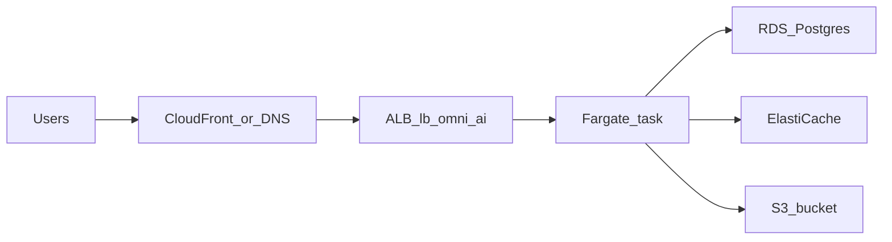

This is the **previous** live stack. AWS prod was left running as rollback. It is **not** what `app.omniaichatbot.com` serves today.

Account `338428745150`, region `eu-central-1`.

## Confirmed inventory (read-only check, 31 August 2026)

| Resource | Value |
| --- | --- |
| ECS cluster (prod) | `omniai-cluster-1` |
| ECS service | `omniai-task-def-service` |
| Task family (when last live) | `omniai-task-def:99` |
| Task size | 2 vCPU / 4 GB (Rails 1.5/3 GB \+ Sidekiq 0.5/1 GB) |
| ECR prod | `omniai` in account `338428745150` |
| ALB | `lb-omni-ai-592724678.eu-central-1.elb.amazonaws.com` |
| RDS | `omniai-prod-restored-database.chw4qmuwu7f7.eu-central-1.rds.amazonaws.com`, `db.t4g.micro`, Postgres 17.9, 30 GB, publicly reachable, about 1.7 GB used |
| Redis prod | `omi-redis-new-001`, `cache.t4g.micro`, Redis 7.1 |
| S3 | `omniai-s3bucket-v1` (legacy). ECS env file path was `s3://omniai-s3bucket-v1/.private/vars.env` |
| CloudFront | Was in front of `app` before Cloudflare cutover |

NAT: none. Staging on AWS is a second stack (see below).

## AWS staging (still exists)

Workflow: `.github/workflows/build_and_push_aws_stage.yml` on branches `omniai_staging` and `staging`.

| Resource | Value |
| --- | --- |
| ECR | `ominiai/staging` (note the typo: ominiai) |
| Cluster | `omniai-cluster-staging` |
| Service | `omniai-staging-task-def-service-o6lhioqv` |
| Redis | `omi-redis-new-stg-001` |
| Task def file | `.aws/task-definition-stage.json` |

Cloudflare `staging` no longer points at the AWS ALB. The ECS service may still be running and still costs money. Public `staging.omniaichatbot.com` is the new Droplet (502 until the app is up).

## GitHub Actions trap

`.github/workflows/build_and_push_aws.yml` runs on push to `omniai`. Secrets used: `AWS_SECRET_ID` / `AWS_ACCESS_KEY` (the names that last succeeded against account `338428745150`). Older secret names `AWS_ACCESS_KEY_ID` / `AWS_SECRET_ACCESS_KEY` pointed at dead account `142083259984` and cannot push to ECR.

A green ECS deploy still does **not** update live customers.
