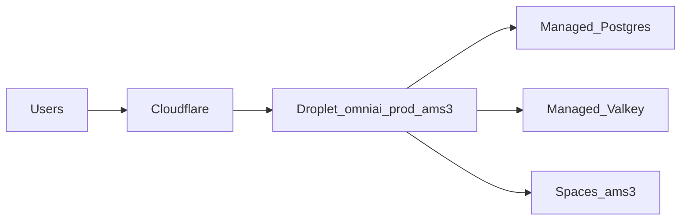

Verified 1 September 2026. Live product traffic is **not** AWS ECS.

## DigitalOcean project **OmniAI** (what you see in the console)

Region **AMS3**. Project ID `f66b1882-ccdd-440e-a68f-30f079059938`. The purpose line in the UI still says "Just trying out DigitalOcean" — ignore that. Do **not** add extra Chatwoot droplets, databases, or Spaces here. `n8n-ams3` is the only extra droplet on purpose — see [n8n](/kb/n8n/start-here). Do **not** move these resources to another project.

| Console name | Kind | Size | Who uses it |
| --- | --- | --- | --- |
| `omniai-prod-ams3` | Droplet, tag `production`, `188.166.84.105` | 8 GB / 160 GB | **Live** Rails \+ Sidekiq \+ Caddy |
| `omniai-staging-ams3` | Droplet, tag `omniai`, `164.92.220.232` | 8 GB / 160 GB | **Staging** app. Its Postgres and Redis run **on this droplet**, not in the managed clusters |
| `n8n-ams3` | Droplet, tags `n8n` + `production`, `167.172.39.204` | 8 GB / 100 GB | **n8n** + parts-api + crawl-proxy. Not Chatwoot. |
| `omniai-prod-pg` | Managed Postgres 17, Online, primary only, tag `omniai` | 2 GB RAM / 30 GiB | **Live only** |
| `omniai-prod-valkey` | Managed Valkey 8, Online, primary only, tag `omniai` | 1 GB RAM | **Live only** (Redis-compatible) |
| `omniai-prod-ams3` (Spaces) | Object storage | ~2395 objects, ~278 MiB | **Live** attachments. Endpoint `https://ams3.digitaloceanspaces.com` |

Those two managed clusters are already paid. Staging must not be pointed at them. n8n does not use them. If you open the project you should see the two Chatwoot droplets, the n8n droplet, the two managed clusters, and Spaces.

Caddy on the Droplet terminates TLS for `app.omniaichatbot.com` and `hc.omniaichatbot.com` and reverse-proxies to Rails on `127.0.0.1:3000`.

## Droplet

| Field | Value |
| --- | --- |
| Name | `omniai-prod-ams3` |
| Public IP | `188.166.84.105` |
| Private IP | `10.50.0.4` |
| Droplet ID | `596589820` |
| Size | 8 GB RAM, 4 vCPU, 160 GB disk (`s-4vcpu-8gb`) |
| OS | Ubuntu 24.04 |
| Region | AMS3 |
| VPC | `4e32eb8f-2fe4-4f1f-9524-702f089f2473` (`10.50.0.0/20`) |
| Project | OmniAI `f66b1882-ccdd-440e-a68f-30f079059938` |
| Swap | 4G at `/swapfile` |
| SSH | `ssh -i ~/.ssh/omniai_do root@188.166.84.105` |

Weekly Droplet backups are on. Typical RAM in use is about 2 GB of 8 GB when Rails and Sidekiq are idle-ish.

## App on the box

| Field | Value |
| --- | --- |
| App dir | `/opt/omniai` |
| Compose file | `docker-compose.production.yaml` |
| Image | `chatwoot:production` (`7b34e4d49faf`, about 2.7 GB) |
| Rails container | `omniai-rails-1` on `127.0.0.1:3000` |
| Sidekiq container | `omniai-sidekiq-1` |
| Source mounts | none — code lives in the image at `/app` |
| Caddyfile | `/etc/caddy/Caddyfile` |

Keep the Droplet compose `image: chatwoot:production`. Do not copy the repo compose over it.

## Managed data (already paid — do not recreate for staging)

| Role | Product | Host / ID |
| --- | --- | --- |
| Database | DigitalOcean managed Postgres 17 | `private-omniai-prod-pg-do-user-11131010-0.a.db.ondigitalocean.com` port `25060`, db `chatwoot_production`, user `doadmin`, ID `0122fa15-2cd5-458a-86f9-2357384419ca` |
| Queue / Action Cable | DigitalOcean managed Valkey | `private-omniai-prod-valkey-do-user-11131010-0.k.db.ondigitalocean.com` port `25061`, ID `99ab6baa-f0a1-4a33-8df1-dd78c9294d4d` |
| Attachments | Spaces | bucket `omniai-prod-ams3`, endpoint `https://ams3.digitaloceanspaces.com`, region `ams3` |

Reach these from the Droplet on the private VPC. User is `doadmin` on Postgres. Valkey user is `default`. Passwords live only in `/opt/omniai/.env`.

Env key names on live (values are secrets except URLs and hostnames):

- App: `FRONTEND_URL`, `HELPCENTER_URL`, `FORCE_SSL` (currently `false` because Caddy terminates TLS), `SECRET_KEY_BASE`, `INSTALLATION_ENV=docker`
- Database: `POSTGRES_HOST`, `POSTGRES_PORT`, `POSTGRES_DATABASE`, `POSTGRES_USERNAME`, `POSTGRES_PASSWORD`
- Cache: `REDIS_URL` (rediss URL to the private Valkey host)
- Storage: `ACTIVE_STORAGE_SERVICE=s3_compatible`, `STORAGE_ENDPOINT`, `STORAGE_REGION`, `STORAGE_BUCKET_NAME`, `STORAGE_ACCESS_KEY_ID`, `STORAGE_SECRET_ACCESS_KEY`, `STORAGE_FORCE_PATH_STYLE=true`
- Mail: see [Email and Resend](/kb/omniai/email-resend)

List price for this stack is about **108 USD / month** (Droplet 48 \+ backups 9.60 \+ Postgres 30.45 \+ Valkey 15 \+ Spaces 5). That is on top of other DigitalOcean projects on the same account.

## What is in front of the Droplet

Users to Cloudflare (orange cloud on `app` and `hc`) to Caddy on the Droplet to Rails on `127.0.0.1:3000`.

Caddyfile hosts: `app.omniaichatbot.com, hc.omniaichatbot.com`.

GitHub Actions still build to AWS ECS. A green ECS run does not update live. See [Ship fixes](/kb/omniai/deploy-hotfixes).
