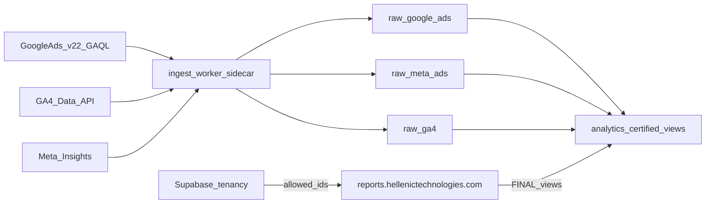

One droplet: ClickHouse + Caddy on 443 + ingest sidecar. No Airbyte box. App is a single Vercel project (`ht-reporting`) on team HT AI. Each customer also has an empty Vercel project `ht-reporting-ai-{slug}` used only to scope an AI Gateway API key.
